# Catálogo Multiplataforma de Interfaces de Usuario (UI)

**Datos de Identificación**
*   **Nombre completo:** Orozco Aguilar Angel Isai
*   **Boleta:** 2024630437
*   **Grupo:** 7CV4
*   **Materia/Proyecto:** Desarrollo de Aplicaciones Móviles / Proyecto Catálogo UI

---
## Descripción General del proyecto:
La descripción de la práctica según las opciones de Classroom: "Construir un catálogo interactivo de elementos de interfaz de usuario e implementarlo en tres tecnologías distintas, para identificar los componentes básicos de una interfaz móvil, sus equivalencias entre plataformas y las diferencias entre los enfoques de construcción de interfaces."
 
La finalidad de la práctica es desarrollar este catalogo en tres tecnologias diferentes:
- Android nativo con Views y XML.
- Android Nativo con Jetpack Compose con Kotlin y funciones Composables.
- Flutter con Dart y rutas. 
 

Aparte la aplicación debe contar con una forma sencilla de navegación (La forma en que lo hice, es mediante un botón de retorno a la pestaña principal donde se tiene acceso a las seis secciones). Para saber que hace cada elemento se puede interactur con el (en caso de ser interactivo cómo las botones o las listas, al interactuar con ellos, se mostrará un mensaje con sus funciones). Las aplicaciones responden a los temas del telefono.  

## Tabla de Equivalencias de Componentes

Esta tabla relaciona los componentes utilizados para construir cada elemento del catálogo a través de los tres paradigmas de desarrollo.

| Elemento de UI | Views (XML) | Jetpack Compose (Kotlin) | Flutter (Dart) | Notas / Solución a equivalencias directas |
| :--- | :--- | :--- | :--- | :--- |
| **Entrada de Texto** | `EditText` / `TextInputLayout` | `OutlinedTextField` | `TextField` / `TextFormField` | En Compose y Flutter el estado del texto se maneja de forma reactiva/controlada, mientras que en XML es imperativo. |
| **Botones Básicos** | `MaterialButton` | `Button`, `OutlinedButton`, `TextButton` | `ElevatedButton`, `OutlinedButton`, `TextButton` | Equivalencia directa al estándar de Material Design. |
| **Botón Flotante** | `FloatingActionButton` | `FloatingActionButton` | `FloatingActionButton` | Equivalencia directa en las tres tecnologías. |
| **Selector Segmentado** | `MaterialButtonToggleGroup` | `SegmentedButton` | `SegmentedButton` | En XML requería agrupar botones; Compose y Flutter lo ofrecen como componente nativo de Material 3. |
| **Casilla (Checkbox)** | `CheckBox` | `Checkbox` / `TriStateCheckbox` | `Checkbox` | En Flutter, el estado indeterminado se logra asignando la variable a `null` (`tristate: true`). |
| **Botón de Radio** | `RadioGroup` + `RadioButton` | `Row` / `Column` + `RadioButton` | `RadioListTile` | Compose y Flutter no requieren un "RadioGroup" formal, la exclusión se maneja mediante la variable de estado. |
| **Interruptor** | `SwitchMaterial` | `Switch` | `Switch` / `SwitchListTile` | Equivalencia directa. |
| **Deslizador** | `Slider` | `Slider` / `RangeSlider` | `Slider` / `RangeSlider` | Equivalencia directa. |
| **Lista Desplegable** | `Spinner` / `AutoCompleteTextView` | `ExposedDropdownMenuBox` | `DropdownMenu` | `Spinner` está obsoleto; se adaptaron los menús expuestos modernos de Material 3 en las 3 plataformas. |
| **Selectores (Fecha/Hora)**| `DatePickerDialog` / `TimePickerDialog` | `DatePicker` / `TimePicker` | `showDatePicker()` / `showTimePicker()`| Compose requiere armar el contenedor del diálogo manualmente; Flutter y XML proveen el diálogo completo de forma nativa. |
| **Chips** | `ChipGroup` + `Chip` | `FilterChip` | `FilterChip` | Equivalencia directa. |
| **Lista Vertical** | `RecyclerView` + `Adapter` + `ViewHolder` | `LazyColumn` | `ListView.builder` | Compose y Flutter eliminan la necesidad de crear Adapters y ViewHolders complejos. |
| **Cuadrícula** | `RecyclerView` + `GridLayoutManager`| `LazyVerticalGrid` | `GridView.builder` | Se define la cantidad de columnas directamente en el delegado de la lista reactiva. |
| **Encabezados (Sticky)** | `ItemDecoration` (Implementación manual) | `stickyHeader` (Dentro de `LazyColumn`) | `CustomScrollView` + `SliverPersistentHeader`| En XML no existe un componente nativo sencillo para esto; requiere calcular posiciones y dibujar sobre el Canvas. |
| **Carga de Imágenes** | `ImageView` + Librería Glide/Picasso | `AsyncImage` (Librería Coil) | `Image.network` | Flutter incluye decodificación de imágenes por red de forma nativa sin librerías de terceros. |
| **Progreso** | `ProgressBar` | `CircularProgressIndicator` / `Linear` | `CircularProgressIndicator` / `Linear`| Equivalencia directa. |
| **Badge (Distintivo)** | `BadgeDrawable` | `BadgedBox` + `Badge` | `Badge` | Equivalencia directa (Material 3). |
| **Retroalimentación** | `Toast` / `Snackbar` | `SnackbarHost` / `Toast` nativo | `ScaffoldMessenger.showSnackBar()` | Flutter deprecó los Toasts en favor de los Snackbars anclados al Scaffold principal. |
| **Diálogos** | `AlertDialog.Builder` | `AlertDialog` | `showDialog()` + `AlertDialog` | Equivalencia directa, cambiando el control de visibilidad (variable bool en Compose vs método en Flutter/XML). |
| **Hoja Inferior** | `BottomSheetDialog` | `ModalBottomSheet` | `showModalBottomSheet()` | Equivalencia directa. |
| **Contenedor Lineal** | `LinearLayout` (Vertical/Horizontal) | `Column` / `Row` | `Column` / `Row` | Equivalencia directa. |
| **Superposición** | `FrameLayout` / `ConstraintLayout` | `Box` | `Stack` | Equivalencia directa para apilar elementos en el eje Z. |
| **Pestañas / Navegación** | `BottomNavigationView` / `TabLayout` | `NavigationBar` / `TabRow` | `NavigationBar` / `TabBar` | Equivalencia directa. |

## Documentación por Aplicación
### Documentación en Views
[Documentación de la aplicación en Views](android-views/README.md)

  
<b>Clic para ver las Capturas de Pantalla.</b>

   
  ### Sección 1: Entrada de Texto
  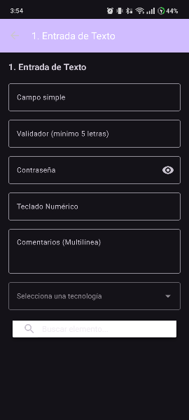  
  ### Sección 2: Botones y Acciones
  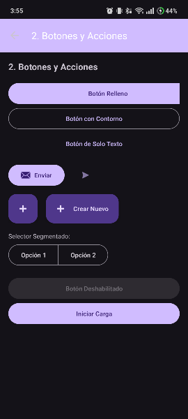  
  ### Sección 3: Elementos de Selección
  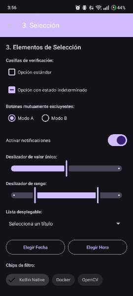  
  ### Sección 4: Listas y Colecciones
  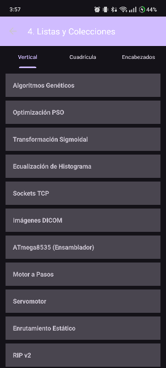 
  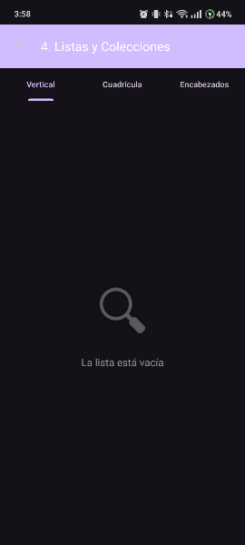  
  ### Sección 5: Información y Retroalimentación
  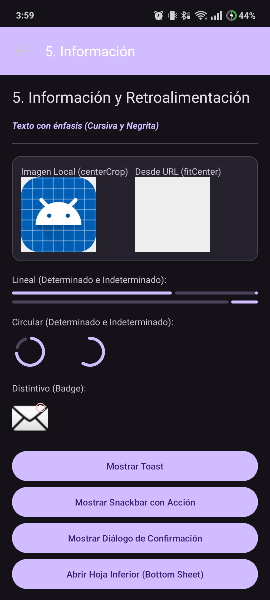  
  ### Sección 6: Contenedores y Estructura
  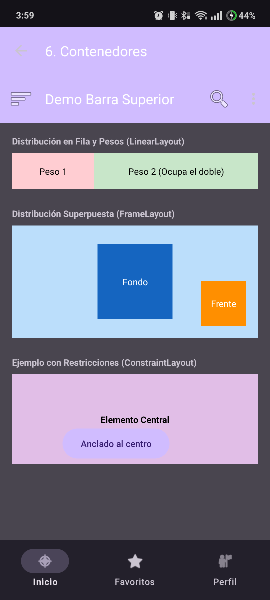  

### Documentación en Jetpack Compose
[Documentación de la aplicación en JetpackCompose](andoid-compose/README.md)

  
<b>Clic para ver las Capturas de Pantalla.</b>

   
  ### Sección 1: Entrada de Texto
  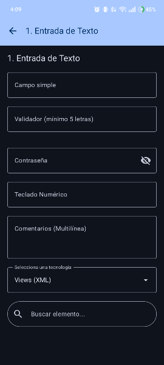  
  ### Sección 2: Botones y Acciones
  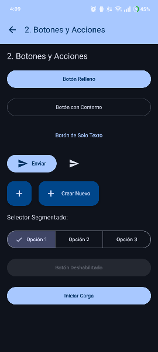  
  ### Sección 3: Elementos de Selección
  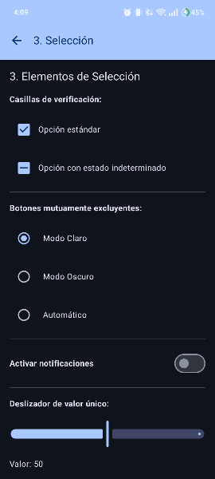  
  ### Sección 4: Listas y Colecciones
  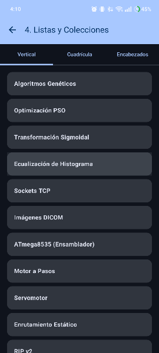 
  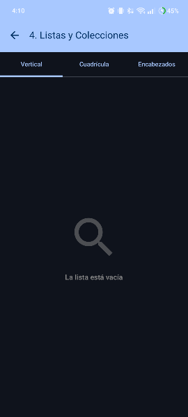  
  ### Sección 5: Información y Retroalimentación
  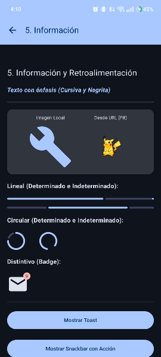  
  ### Sección 6: Contenedores y Estructura
  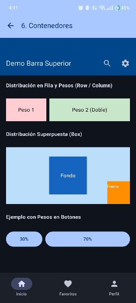  

### Documentación en Flutter
[Documentación de la aplicación en Flutter](app_basicas_flutter/README.md)

  
<b>Clic para ver las Capturas de Pantalla.</b>

   
  ### Sección 1: Entrada de Texto
  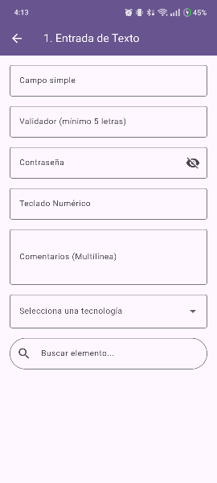  
  ### Sección 2: Botones y Acciones
  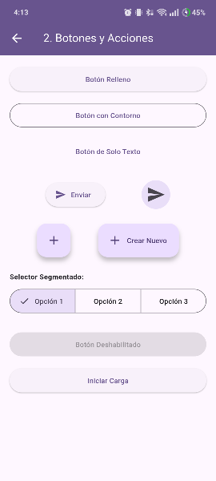  
  ### Sección 3: Elementos de Selección
  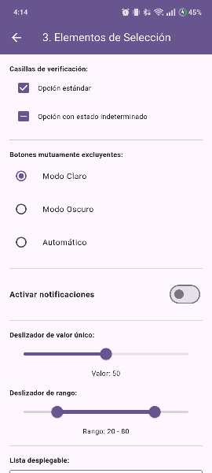  
  ### Sección 4: Listas y Colecciones
  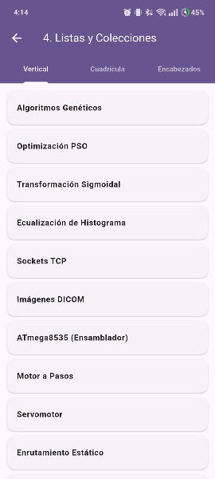 
  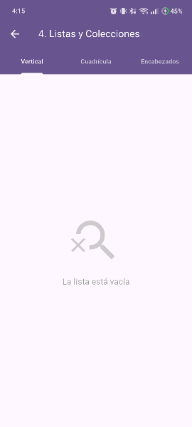  
  ### Sección 5: Información y Retroalimentación
  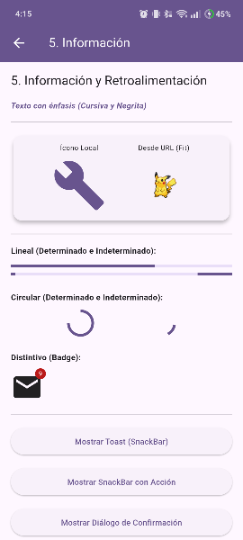  
  ### Sección 6: Contenedores y Estructura
  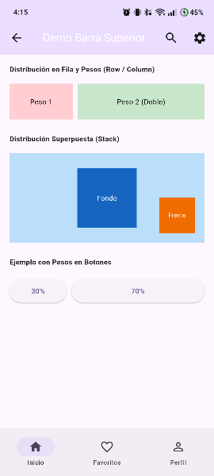  

## Referencias (Formato APA)

*   Android Developers. (2024). *Build a UI with Jetpack Compose*. Google. Recuperado de https://developer.android.com/compose
*   Android Developers. (2024). *Layouts and Views*. Google. Recuperado de https://developer.android.com/guide/topics/ui/declaring-layout
*   Flutter Developers. (2024). *Flutter Widget Catalog*. Google. Recuperado de https://docs.flutter.dev/ui/widgets
*   Coil Contributors. (2024). *Coil: Image loading for Android backed by Kotlin Coroutines*. Recuperado de https://coil-kt.github.io/coil/compose/